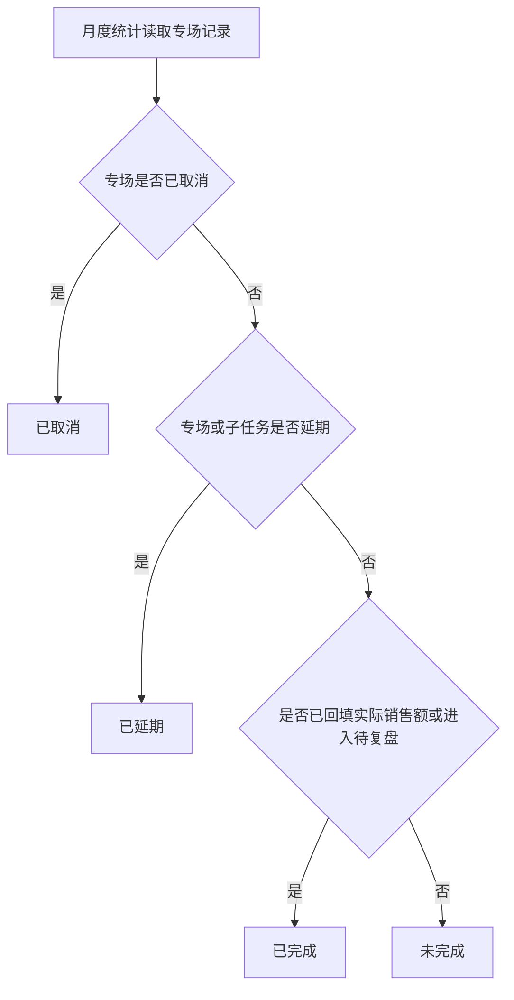

# 达播专场产品状态机梳理

更新时间：2026-07-06

本文梳理当前达播专场排期管理原型中的核心状态机。状态分为五层：专场主状态、模块派工状态、子任务状态、商务提醒状态、月度统计派生状态。它们各自服务不同页面，但需要通过同一套业务规则联动，避免“列表显示一种状态、任务页又显示另一种状态”的情况。

## 1. 状态分层

| 层级 | 使用页面 | 状态来源 | 说明 |
| --- | --- | --- | --- |
| 专场主状态 | 专场列表、达人专场录入、专场详情 | 专场记录字段 | 描述一场达播专场从录入到复盘的生命周期 |
| 模块派工状态 | 需求派工、专场详情需求池 | 派工模块字段 | 描述内容、剪辑、投放、运营四类需求是否已派发及是否完成 |
| 子任务状态 | 我的任务、需求派工、子任务弹窗 | 子任务字段 | 描述组员实际执行的每一条任务节点 |
| 商务提醒状态 | 需求派工、专场详情、子任务弹窗 | 子任务更新派生 | 用红点提醒商务有新增、上传或完成的任务需要查看 |
| 月度统计状态 | 数据中心-专场统计 | 专场与任务数据派生 | 用于业务按月统计已完成、未完成、延期、取消 |

## 2. 专场主状态机

### 状态定义

| 状态 | 触发条件 | 可见页面 | 下一步 |
| --- | --- | --- | --- |
| 待录入 | 用户进入达人专场录入，尚未创建专场 | 达人专场录入 | 填写信息并保存 |
| 待识别 | 专场已创建，文档或信息等待识别确认 | 专场列表、录入页 | 确认专场信息 |
| 已排期 | 专场时间、商务、主推产品、直播间等信息已确认 | 专场列表、日历、统计 | 发布派工或延期/取消 |
| 派工中 | 内容、剪辑、投放、运营负责人已开始派发任务 | 专场列表、需求派工、我的任务 | 等待任务完成和直播执行 |
| 待复盘 | 专场已直播，等待实际销售额、复盘与数据回填 | 专场列表、数据中心 | 回填后进入已完成 |
| 已完成 | 实际销售额或复盘结果已回填，统计上闭环 | 数据中心、月度统计 | 结束 |
| 已延期 | 专场或关键子任务延期，需要留存原因和新时间 | 专场列表、统计、我的任务 | 确认新排期后回到已排期或派工中 |
| 已取消 | 专场取消，必须填写取消原因并留存 | 专场列表、统计 | 结束 |

### Mermaid

```mermaid
stateDiagram-v2
  state pendingInput as "待录入"
  state pendingRecognition as "待识别"
  state scheduled as "已排期"
  state dispatching as "派工中"
  state waitingReview as "待复盘"
  state completed as "已完成"
  state delayed as "已延期"
  state canceled as "已取消"

  [*] --> pendingInput : 打开新建专场
  pendingInput --> pendingRecognition : 商务填写并保存
  pendingRecognition --> scheduled : 识别或手动确认
  scheduled --> dispatching : 发布派工
  dispatching --> waitingReview : 直播结束
  waitingReview --> completed : 回填实际销售额和复盘
  scheduled --> delayed : 专场延期
  dispatching --> delayed : 任务延期影响排期
  delayed --> scheduled : 确认新排期
  scheduled --> canceled : 创建后取消并填写原因
  dispatching --> canceled : 已派发后取消并填写原因
  waitingReview --> canceled : 复盘前确认取消
  completed --> [*]
  canceled --> [*]
```

## 3. 模块派工状态机

模块派工指一场专场下的内容需求、剪辑需求、投放需求、运营需求。每个模块有负责人，并拆成若干子任务。

| 状态 | 说明 | 计算或触发规则 |
| --- | --- | --- |
| 待派发 | 需求已识别，但负责人尚未发布派工 | 无子任务或未发布 |
| 已派发 | 负责人已发布任务，子任务进入执行 | 点击发布派工 |
| 延期中 | 至少一个子任务延期 | 任一子任务状态为延期中 |
| 已取消 | 该模块所有子任务均取消，或负责人取消模块任务 | 取消需填写原因 |
| 已完成 | 该模块所有子任务均完成 | 所有子任务状态为已完成 |

```mermaid
stateDiagram-v2
  state pendingDispatch as "待派发"
  state dispatched as "已派发"
  state delayed as "延期中"
  state completed as "已完成"
  state canceled as "已取消"

  [*] --> pendingDispatch : 需求识别完成
  pendingDispatch --> dispatched : 负责人发布派工
  dispatched --> delayed : 任一子任务延期
  delayed --> dispatched : 调整计划后继续执行
  dispatched --> completed : 全部子任务完成
  delayed --> completed : 延期任务完成
  dispatched --> canceled : 模块取消并填写原因
  delayed --> canceled : 延期后取消
  completed --> [*]
  canceled --> [*]
```

## 4. 子任务状态机

子任务是组员实际执行的最小任务单元，例如脚本确认、剪辑视频、达人画像、人群包、直播设备确认等。

关键规则：

- 上传文件只代表“文件已保存”，不会自动完成任务。
- 点击“提交文档”或“提交完成”后，任务才进入已完成。
- 内容类任务提交前需要填写编导备注或文档说明。
- 延期和取消都必须填写原因，原因需要被负责人和商务查看。
- 已取消任务不能再提交完成。
- 旧版本中的“待审核”仅作为历史兼容态，不再作为新流程状态；上传即保存，提交即完成。

| 状态 | 说明 | 可执行动作 |
| --- | --- | --- |
| 待处理 | 任务已创建，组员尚未开始 | 上传文件、延期、取消、填写备忘录 |
| 进行中 | 组员已上传文件或开始处理 | 继续上传、提交完成、延期、取消、填写备忘录 |
| 延期中 | 组员或负责人填写延期原因和新计划时间 | 继续编辑延期、提交完成、取消 |
| 已取消 | 任务取消且原因留存 | 查看取消原因、查看备忘录 |
| 已完成 | 组员点击提交后完成 | 查看附件、备忘录、完成记录 |

```mermaid
stateDiagram-v2
  state pending as "待处理"
  state running as "进行中"
  state delayed as "延期中"
  state completed as "已完成"
  state canceled as "已取消"

  [*] --> pending : 任务创建
  pending --> running : 开始处理或上传文件
  running --> running : 上传文件仅保存附件
  running --> delayed : 申请延期并填写原因
  delayed --> running : 调整完成时间继续处理
  running --> completed : 点击提交完成
  pending --> canceled : 取消并填写原因
  running --> canceled : 取消并填写原因
  delayed --> canceled : 取消并填写原因
  completed --> [*]
  canceled --> [*]
```

## 5. 商务提醒状态机

红点提醒不是主状态，而是由子任务变化派生出来的通知状态，用来提醒商务或负责人查看更新。

| 提醒状态 | 产生条件 | 消除条件 |
| --- | --- | --- |
| 无提醒 | 无新增、无上传、无完成更新 | 默认状态 |
| 新增提醒 | 负责人新增子任务 | 商务查看或处理 |
| 附件已上传提醒 | 组员上传附件但未提交完成 | 商务查看或组员提交完成 |
| 完成提醒 | 组员提交完成 | 商务查看或处理 |
| 已读/处理 | 商务查看详情或关闭提醒 | 回到无提醒 |

```mermaid
stateDiagram-v2
  state noNotice as "无提醒"
  state newNotice as "新增提醒"
  state uploadedNotice as "附件已上传提醒"
  state doneNotice as "完成提醒"
  state cleared as "已读/处理"

  [*] --> noNotice
  noNotice --> newNotice : 新增子任务
  noNotice --> uploadedNotice : 上传附件
  newNotice --> uploadedNotice : 上传附件
  uploadedNotice --> doneNotice : 点击提交完成
  newNotice --> doneNotice : 直接提交完成
  doneNotice --> cleared : 商务查看或处理
  uploadedNotice --> cleared : 商务查看
  cleared --> noNotice
```

## 6. 月度统计派生状态

数据中心的月度专场统计不建议让用户手动维护一套独立状态，而应从专场主状态、实际销售额、子任务延期/取消信息中派生。

| 统计状态 | 判定优先级 | 规则 |
| --- | --- | --- |
| 已取消 | 最高 | 专场状态为已取消 |
| 已延期 | 第二 | 专场状态为已延期，或存在延期子任务 |
| 已完成 | 第三 | 已进入待复盘、已回填实际销售额、或已有达标率 |
| 未完成 | 最后 | 不满足以上条件 |



## 7. 筛选状态建议

| 页面 | 推荐筛选项 | 备注 |
| --- | --- | --- |
| 专场列表 | 排期时间、搜索、等级、全部/进行中/待复盘 | 日历与卡片列表同步 |
| 达人专场录入 | 状态：已排期、已延期、已取消 | 取消时必须填写原因 |
| 需求派工 | 模块、专场、任务完成情况 | 已发布后进入观察视角 |
| 我的任务 | 任务优先级、任务节点、专场名称搜索 | 不保留查看范围排序 |
| 数据中心-专场统计 | 统计月份、负责商务、状态、等级、主推产品 | 状态为统计派生 |
| 数据中心-数据板块 | 专场时间、支持类型、成员、状态 | 指标页按 tab 切换 |

## 8. 字段建议

| 字段 | 建议归属 | 说明 |
| --- | --- | --- |
| `special.status` | 专场 | 当前主流程状态，例如待识别、已排期、派工中、待复盘 |
| `special.scheduleStatus` | 专场 | 业务排期状态，例如已排期、已延期、已取消 |
| `special.cancelReason` | 专场 | 专场取消原因，必填留存 |
| `assignment.status` | 模块派工 | 内容、剪辑、投放、运营模块状态 |
| `task.status` | 子任务 | 待处理、进行中、延期中、已取消、已完成 |
| `task.files` | 子任务 | 上传附件，上传后只保存文件 |
| `task.memoHistory` | 子任务 | 节点备忘录和编辑记录 |
| `task.delayReason` | 子任务 | 延期原因 |
| `task.cancelReason` | 子任务 | 取消原因 |
| `task.businessNotice` | 提醒 | 新增、上传、完成等商务提醒 |
| `monthlyStatus` | 统计派生 | 不建议入库为主状态，按规则实时计算 |

## 9. 需要重点统一的产品规则

1. 专场取消：创建后或已派发后都可以取消，必须填写取消原因，并在月度统计中归为已取消。
2. 子任务取消：负责人或组长可取消已派发子任务，必须填写取消原因，原因需要被查看和留存。
3. 文件上传：上传只是保存附件，不代表完成；点击提交后才完成。
4. 内容任务：提交时必须有文档或附件，也需要有编导备注。
5. 商务提醒：新增任务、上传附件、提交完成都需要红点提醒；取消任务不触发红点，但原因要可查看。
6. 月度统计：已取消优先级最高，其次延期，再判断是否完成，最后才是未完成。
